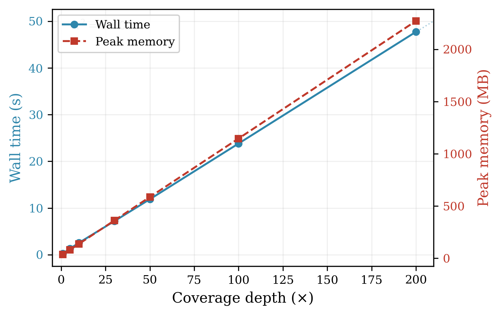
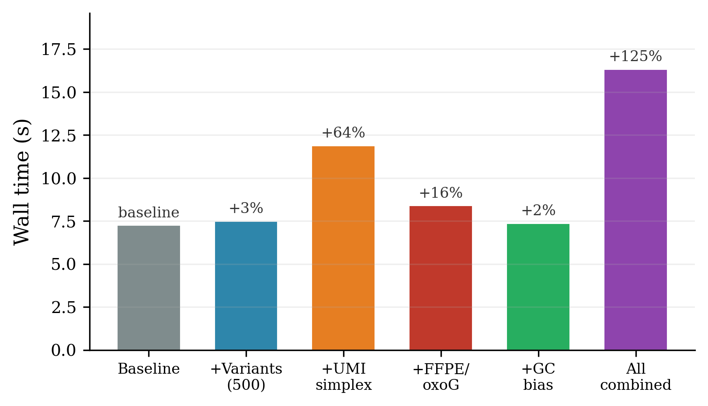
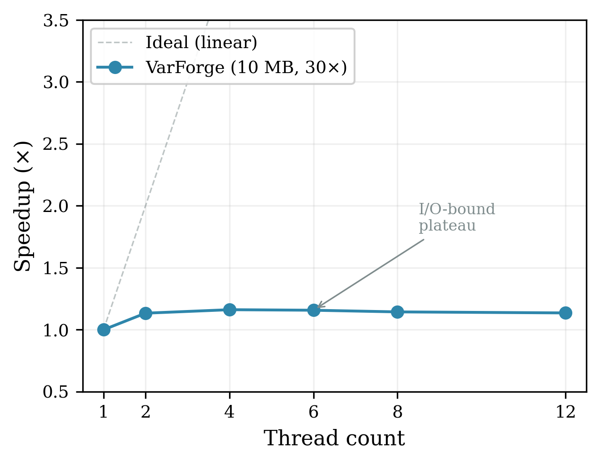
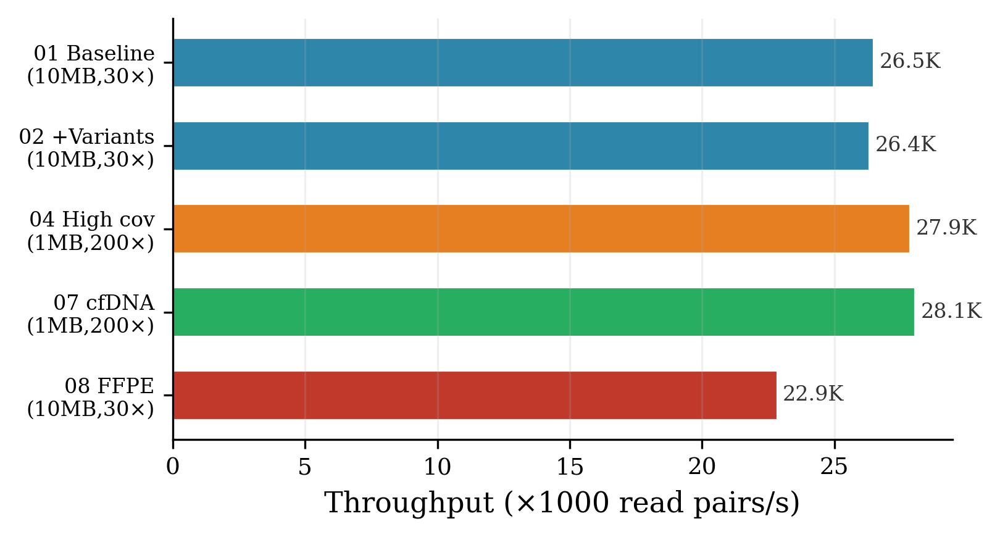
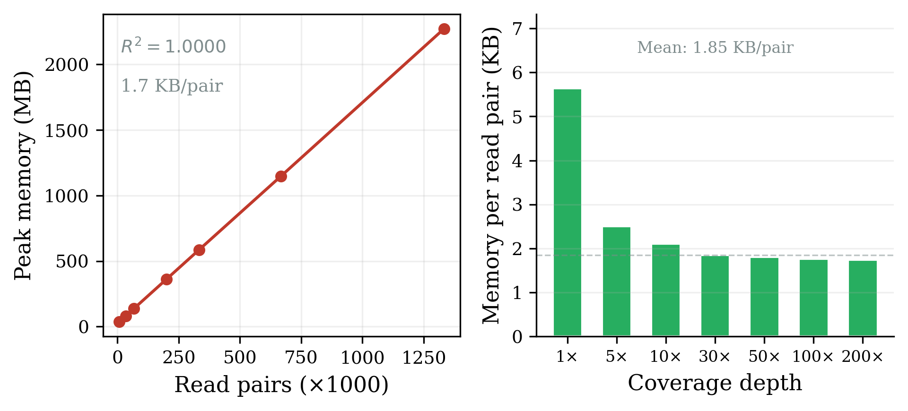

# Benchmark Results

Hardware and methodology: [hardware.md](hardware.md), [methodology.md](methodology.md).
Raw data: `benchmark_output/results.json`.
Figures: `docs/paper/fig_*.pdf`.

---

## Coverage Scaling

1 MB reference, 100 mutations, 12 threads, 3 iterations each.

| Coverage | Read Pairs | Wall (s) | Peak RAM (MB) | Pairs/s |
|----------|-----------|----------|---------------|---------|
| 1× | 6,735 | 0.25 | 37 | 26,940 |
| 5× | 33,675 | 1.30 | 81 | 25,904 |
| 10× | 67,350 | 2.54 | 137 | 26,516 |
| 30× | 202,050 | 7.18 | 362 | 28,140 |
| 50× | 336,750 | 11.88 | 586 | 28,345 |
| 100× | 673,335 | 23.81 | 1,146 | 28,279 |
| 200× | 1,346,670 | 47.74 | 2,271 | 28,209 |

Both wall time and peak memory scale linearly with coverage (R² > 0.999). Throughput stabilises at ~28,000 pairs/s above 10×. Memory usage is ~1.7 KB per read pair, consistent across all depths.

---

## Feature Overhead

1 MB reference, 30× (~200K read pairs), 12 threads, 3 iterations each.

| Feature | Wall (s) | Overhead | Peak RAM (MB) |
|---------|----------|----------|---------------|
| Baseline | 7.24 | — | 362 |
| +Variants (500) | 7.49 | +3% | 363 |
| +UMI simplex | 11.88 | +64% | 1,092 |
| +FFPE/oxoG | 8.38 | +16% | 416 |
| +GC bias | 7.36 | +2% | 362 |
| All combined | 16.32 | +125% | 1,264 |

Variant injection and GC bias are within noise. FFPE adds 16% (per-base damage pass). UMI dominates at +64% (PCR family tracking). Combined overhead is super-additive due to UMI carrying variant/artefact state through PCR cycles.

---

## Main Scenarios

12 threads, mean of 3 runs (or 1 where noted).

| Config | Ref | Cov | Variants | Features | Wall (s) | Peak RAM (GB) |
|--------|-----|-----|----------|----------|----------|---------------|
| Baseline | 10 MB | 30× | — | — | 75.4 | 3.4 |
| +Variants | 10 MB | 30× | 500 | — | 75.9 | 3.4 |
| High coverage | 10 MB | 100× | 500 | — | 251.1 | 11.1 |
| Very high cov | 1 MB | 200× | 100 | — | 47.8 | 2.2 |
| cfDNA | 1 MB | 200× | 200 | cfDNA, 2% pur. | 47.5 | 2.3 |
| FFPE + oxoG | 10 MB | 30× | 500 | artefacts | 87.5 | 4.4 |
| Panel + UMI | 1 MB | 200× | 50 | UMI simplex | 76.8 | 7.0 |

### Key findings

- **Baseline throughput**: ~13,400 pairs/s (10 MB, 30×, 12 threads) → ~4.0 Gbp/min
- **Variant overhead**: +500 mutations adds <1% wall time
- **FFPE overhead**: +16% wall time
- **cfDNA**: Efficient — 1 MB at 200× in 47.5 s
- **Projected 3 Gb WGS 30×**: ~12.4 hours (linear extrapolation)

---

## Thread Scaling

10 MB reference, 30×, 500 variants, 3 iterations each.

| Threads | Wall (s) | Speedup | Efficiency |
|---------|----------|---------|------------|
| 1 | 86.0 | 1.00× | 100% |
| 2 | 75.8 | 1.13× | 57% |
| 4 | 74.0 | 1.16× | 29% |
| 6 | 74.3 | 1.16× | 19% |
| 8 | 75.1 | 1.14× | 14% |
| 12 | 75.7 | 1.14× | 10% |

Thread scaling plateaus at ~1.16× above 2 threads, indicating I/O saturation. Writing ~280 MB compressed FASTQ dominates wall time regardless of core count. Compute-bound workloads (higher coverage, more features) would show better parallel efficiency.

---

## Throughput Summary

| Scenario | Pairs/s | Regime |
|----------|---------|--------|
| Baseline (10 MB, 30×) | ~13,400 | I/O-bound |
| +500 variants | ~13,300 | I/O-bound |
| cfDNA (1 MB, 200×) | ~14,100 | I/O-bound |
| FFPE (10 MB, 30×) | ~14,400 | I/O-bound |
| Coverage plateau (1 MB) | ~28,000 | Compute-bound |

---

## Memory Efficiency

The streaming architecture bounds peak memory to `buffer_depth × batch_size` regardless of total dataset size. Per-pair memory is ~1.7 KB, consistent across all tested depths.

### Projected memory for full human genome

| Depth | Read Pairs | Est. Wall Time | Required RAM |
|-------|-----------|----------------|-------------|
| 30× | 600M | ~12.4 hours | ~16 GiB (streaming) |
| 100× | 2B | ~41.4 hours | ~16 GiB (streaming) |

With the streaming output pipeline, memory is bounded by channel depth (64 batches × ~170 MB = ~10.5 GiB theoretical ceiling), making full human genome simulation feasible on standard workstations.
